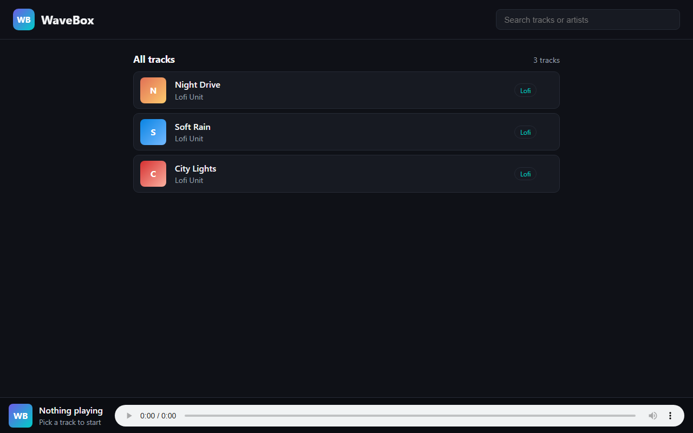

# WaveBox

**Built:** February 2026  
**Author:** [Panashe Sanyanga](https://github.com/code-by-panashe-sanyanga)

A small music player web app. FastAPI serves track metadata from a JSON file, and a plain HTML/CSS/JavaScript page lists the tracks and plays audio through the browser. I built this to practise calling an API from JavaScript and updating the UI when the user picks a song.

This is not a full Spotify clone — it is a focused learning project that runs locally.

---

## What this project does

1. On load, the frontend calls `GET /api/tracks` and builds a clickable track list.
2. When you click a track, the app sets the HTML5 `<audio>` element source and highlights the active row.
3. A **Now playing** panel shows the current title and artist.
4. FastAPI also serves the static files (`index.html`, `style.css`, `app.js`) from the same server on port 8000.

Audio files are external demo MP3 links (SoundHelix), so you need internet to hear playback.

---

## Why I chose each technology

| Technology | Why I used it |
|------------|---------------|
| **Python + FastAPI** | After StreamFlix in Node, I wanted to try a Python API. FastAPI is modern, has automatic API docs, and is quick to write. |
| **Uvicorn** | Standard ASGI server for running FastAPI locally with `--reload` during development. |
| **tracks.json** | Keeps song data separate from Python code — I can add tracks without editing route logic. |
| **Vanilla HTML/CSS/JS** | Same approach as my other projects: learn `fetch` and DOM updates without a framework. |
| **HTML5 `<audio>`** | Built-in browser playback — no extra audio library needed for a simple player. |

---

## Folder structure

```
WaveBox/
├── main.py              # FastAPI app, API routes, static file mounting
├── tracks.json          # Track catalogue (title, artist, genre, MP3 URL)
├── requirements.txt     # Python packages to install
├── static/
│   ├── index.html       # Player layout (audio element, track list)
│   ├── style.css        # Layout and active-track styling
│   └── app.js           # Loads tracks, handles click-to-play
├── screenshots/
│   └── player.png       # README screenshot
├── .gitignore
└── README.md
```

---

## How to run it

### Prerequisites

- Python 3.10 or newer

### Installation

```bash
python -m venv venv
venv\Scripts\activate        # Windows
# source venv/bin/activate   # macOS/Linux

pip install -r requirements.txt
uvicorn main:app --reload --port 8000
```

Open **http://localhost:8000** in your browser.

API docs (auto-generated by FastAPI): **http://localhost:8000/docs**

---

## Frontend files in detail

| File | What it does |
|------|----------------|
| **static/index.html** | Page shell: `<audio id="player">` with controls, a “Now playing” heading, track count, and an empty `<ul id="tracks">` filled by JavaScript. |
| **static/style.css** | Centres the player, styles the track list rows, and adds an `.active` class for the currently playing track. |
| **static/app.js** | On `DOMContentLoaded`, fetches `/api/tracks`, renders list items with `data-id`, updates `now-playing` text on click, sets `player.src` to the track URL, and calls `player.play()`. |

The frontend uses relative paths like `/api/tracks` because it is served from the same origin as the API.

---

## Backend files in detail

| File | What it does |
|------|----------------|
| **main.py** | Creates the FastAPI app, loads `tracks.json` into `TRACKS` at startup, exposes `/api/health`, `/api/tracks`, and `/api/tracks/{id}`, mounts `/static` for CSS/JS, and serves `index.html` at `/`. |
| **requirements.txt** | Lists `fastapi` and `uvicorn` (and their dependencies) for `pip install -r requirements.txt`. |

### API routes

| Method | Endpoint | Description |
|--------|----------|-------------|
| `GET` | `/api/health` | Returns `{ ok: true, tracks: <count> }` |
| `GET` | `/api/tracks` | Full track array from `tracks.json` |
| `GET` | `/api/tracks/{id}` | One track by ID, or `{ error: "track not found" }` |
| `GET` | `/` | Main player page |
| `GET` | `/static/*` | CSS, JavaScript, and other static assets |

### Example track object

```json
{
  "id": 1,
  "title": "Night Drive",
  "artist": "Lofi Unit",
  "genre": "Lofi",
  "url": "https://www.soundhelix.com/examples/mp3/SoundHelix-Song-1.mp3"
}
```

---

## tracks.json — why it exists

`tracks.json` is the single source of truth for the music catalogue. Each entry needs:

- `id` — unique number used in the API and UI
- `title`, `artist`, `genre` — shown in the list and “Now playing” panel
- `url` — direct link to an MP3 file the browser can stream

**Why JSON instead of a database?**

- The catalogue is small and fixed for a demo.
- Editing a JSON file is easier while learning than writing SQL or admin screens.
- The same pattern mirrors `movies.json` in StreamFlix — data file + API that reads it.

After changing `tracks.json`, restart Uvicorn (or let `--reload` pick up the file if you only change Python; JSON is loaded at import time, so a restart is needed for track changes).

---

## venv and dependencies — what not to upload

Running `pip install -r requirements.txt` inside a virtual environment creates a `venv/` folder with installed packages. Like `node_modules` in a Node project:

- **Do not commit `venv/`** — it is large and machine-specific.
- **Do commit** `requirements.txt` so others can recreate the environment.

`.gitignore` should exclude `venv/`, `__pycache__/`, and `.pyc` files.

There is no `node_modules` in this project because the frontend has no npm build step.

---

## Screenshots



---

## Limitations and possible improvements

**Current limitations**

- No playlist, queue, or shuffle — one track at a time.
- Audio depends on external URLs and an internet connection.
- No user accounts, favourites, or search.
- Track list is loaded entirely on page load (fine for a handful of songs).

**Ideas for later**

- Add album art and a progress bar synced to `<audio>`.
- Store favourites in localStorage or a small database.
- Upload local MP3 files instead of external links.

---

## Troubleshooting

| Problem | What to try |
|---------|-------------|
| **`python` not found** | Install Python 3.10+ from [python.org](https://www.python.org/) and tick “Add to PATH”. On Windows, disable the Microsoft Store alias if it intercepts the command. |
| **No sound when clicking a track** | Check your internet connection — MP3s are loaded from SoundHelix. Open the track `url` directly in the browser. |
| **Empty track list** | Confirm `tracks.json` is valid JSON. Hit **http://localhost:8000/api/tracks** — you should see an array. |
| **404 on CSS or JS** | Start the server with `uvicorn main:app` from the project root (where `main.py` lives). |
| **Port 8000 in use** | Use `--port 8001` and open that port instead. |
| **`ModuleNotFoundError: fastapi`** | Activate `venv` and run `pip install -r requirements.txt` again. |

---

## Links

- [Portfolio](https://github.com/code-by-panashe-sanyanga/PS-PORTFOLIO)
- [GitHub profile](https://github.com/code-by-panashe-sanyanga)
